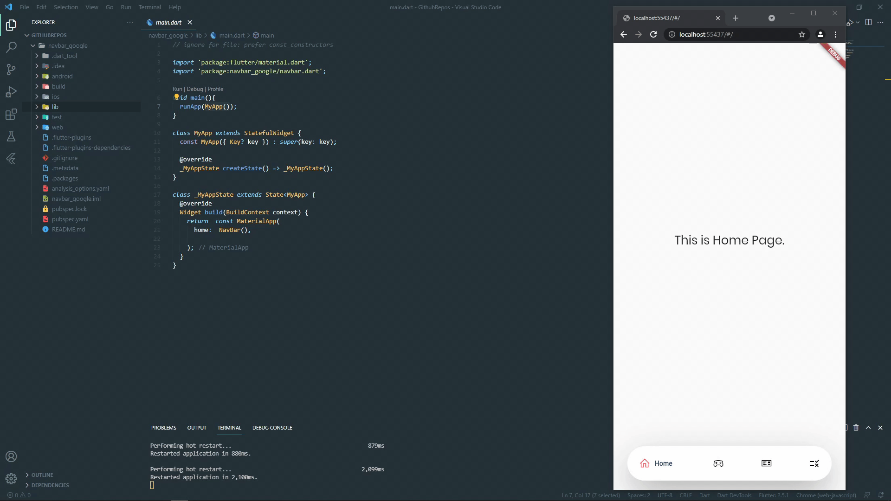
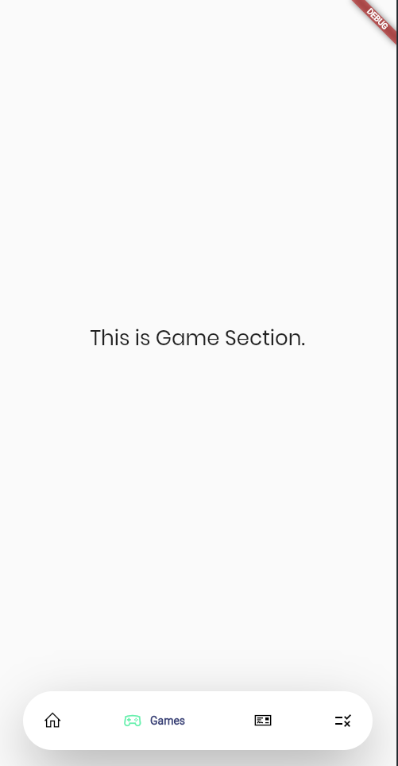

<h1><p align="center">Creating awesome navbar for flutter projects ♥ <\> </h1></p>




## Add dependency
```
dependencies:
  //For icons & stuffs
  line_icons: ^2.0.1 
  
  //For nav_bar
  google_nav_bar: ^5.0.5 
  
  //For fonts
  google_fonts: ^2.1.0
  
```
<summary><h2> How to implement ? </h2></summary>
- Create a flutter project . <br>
- Creating a navbar section as in "navbar.dart" .<br>
- Creating a PageView to control it .<br>
- Creating Widget/Pages accordingly for PageView .<br>
- Finalizing all for testing .<br>
<br>
  
  <summary><h2> Final result should look like this . </h2></summary>
  
  
  


